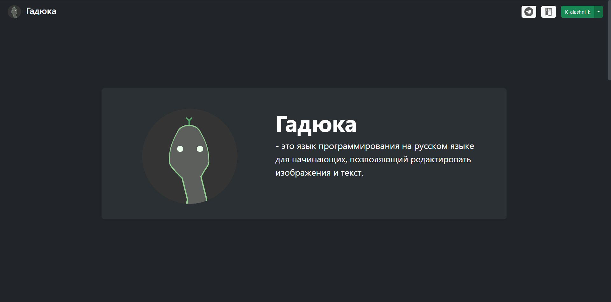
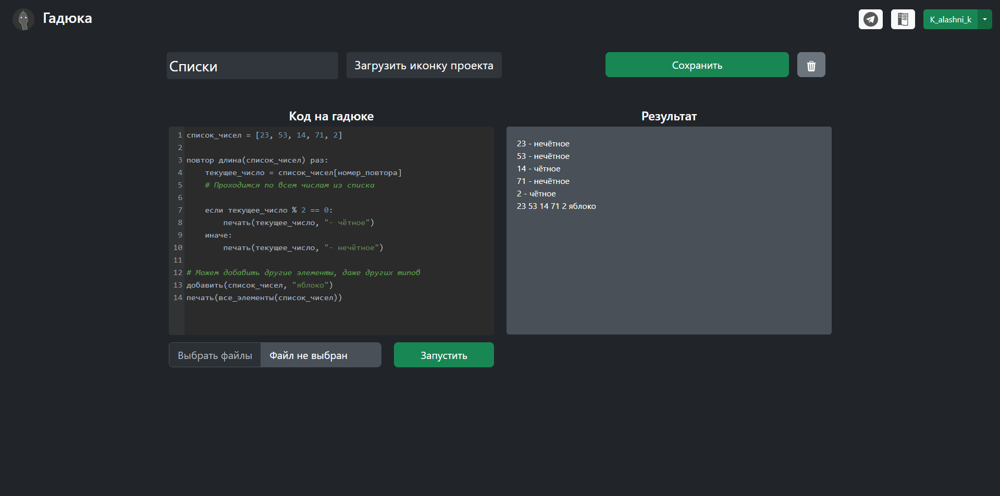

#  Язык программирования «Гадюка»

 - это язык программирования на русском языке для начинающих, представленный в виде сайта https://gaduka.sytes.net/ и документации https://gaduka-docs.readthedocs.io/

### Разделение на микросервисы

* **flask-server** - сайт, вся работа с базой данных, rest api
* **engine-server** - api, который запускает код на Гадюке
* **postgres** - база данных
* **nginx** - маршрутизация запросов между flask-server и engine-server
* **tg_bot** - телеграм бот Гадюки, имеет тот-же функционал, что и сайт, разработан полностью [estestvenno](https://github.com/estestvenno).

### Инструкция для запуска
Необходимо заполнить следующие переменные окружения (или просто заполнить template.env и переименовать в .env):
* `BOT_TOKEN`, `TELEGRAM_BOT_NAME` - токен и ник телеграмм бота. Необходим для входа на сайте и работы телеграм бота, остальной функционал сайта будет работать.
* `REST_API_TOKENS1` и `REST_API_TOKENS2` - токены для доступа к API базы данных (любые строки)
* `POSTGRES_USER`, `POSTGRES_PASSWORD`, `POSTGRES_DATABASE` - данные для базы данных *MySQL* (любые строки без спец. символов)

После заполнения запустить с помощью `docker-compose up`, необходимо иметь запущенный [Docker](https://docker.com/). Сайт будет запущен на http://localhost.

> Для работы виджета входа через telegram необходимо также в BotFather прописать [/setdomain](https://core.telegram.org/widgets/login#:~:text=Once%20you%20have%20chosen%20a%20bot%2C%20send%20the%20/setdomain%20command%20to%20%40Botfather%20to%20link%20your%20website%27s%20domain%20to%20the%20bot.%20Then%20configure%20your%20widget%20below%20and%20embed%20the%20code%20on%20your%20website.) 
для бота, чей токен используется. localhost не подойдёт в качестве домена, для получения временного домена можно использовать [ngrok](https://ngrok.com/).

Если вы хотите запустить модифицированную версию, или просто собрать docker образы сами, то `docker-compose up --build`

Если при первом запуске выдаёт ошибку с базой данных, тогда перезапустите flask-server `docker-compose restart flask-server`